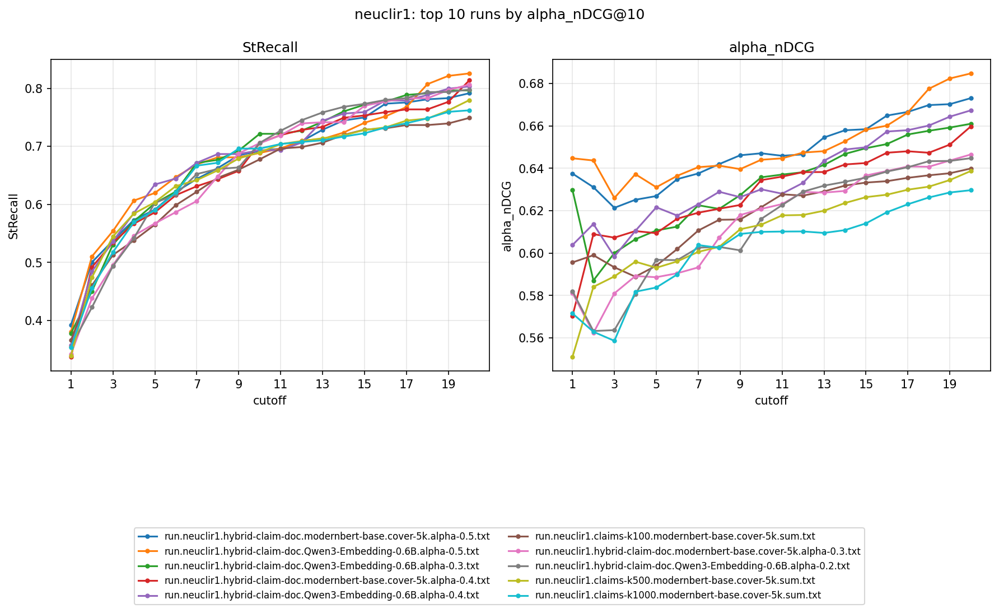

# neuclir1: alpha_nDCG / StRecall vs. cutoff (1-20)

Companion to [RESULT-neuclir1.md](RESULT-neuclir1.md), which has the raw @1/@10/@20
numbers for a quick read. This shows the full cutoff curve for the top 10 runs
ranked by alpha_nDCG@10, so trends across the ranking (not just three fixed
points) are visible at a glance.



Regenerate after new runs land:
```
bash scripts/run_eval_curve.sh neuclir1
python -m src.evaluator.plot_eval_curve \
    --csv results/curve-neuclir1.csv --out results/plots/neuclir1.png \
    --title "neuclir1: top 10 runs by alpha_nDCG@10"
```
