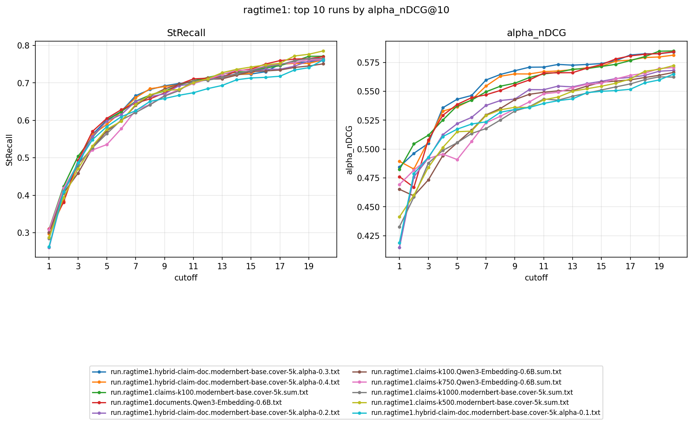

| Run | StRecall@1 | @10 | @20 | alpha_nDCG@10 | @20 |
|---|---|---|---|---|---|
| run.ragtime1.documents.bm25.txt | 0.1901 | 0.5246 | 0.5820 | 0.3638 | 0.3885 |
| run.ragtime1.concat-claims.bm25.txt | 0.1752 | 0.3984 | 0.5156 | 0.2945 | 0.3310 |
| run.ragtime1.documents.modernbert-base.cover-5k.txt | 0.2442 | 0.6592 | 0.7364 | 0.5230 | 0.5491 |
| run.ragtime1.documents.Qwen3-Embedding-0.6B.txt | 0.3101 | 0.6958 | 0.7700 | 0.5598 | 0.5843 |
| run.ragtime1.claims-k100.Qwen3-Embedding-0.6B.rrf.txt | 0.2161 | 0.6688 | 0.7396 | 0.5161 | 0.5412 |
| run.ragtime1.claims-k100.Qwen3-Embedding-0.6B.sum.txt | 0.3014 | 0.6969 | 0.7509 | 0.5475 | 0.5664 |
| run.ragtime1.claims-k100.modernbert-base.cover-5k.rrf.txt | 0.2458 | 0.6496 | 0.7403 | 0.5068 | 0.5377 |
| run.ragtime1.claims-k100.modernbert-base.cover-5k.sum.txt | 0.3097 | 0.6942 | 0.7710 | 0.5619 | 0.5850 |
| run.ragtime1.claims-k1000.Qwen3-Embedding-0.6B.rrf.txt | 0.2161 | 0.6761 | 0.7459 | 0.5181 | 0.5442 |
| run.ragtime1.claims-k1000.Qwen3-Embedding-0.6B.sum.txt | 0.2979 | 0.6893 | 0.7614 | 0.5341 | 0.5624 |
| run.ragtime1.claims-k1000.modernbert-base.cover-5k.rrf.txt | 0.2458 | 0.6576 | 0.7512 | 0.5105 | 0.5438 |
| run.ragtime1.claims-k1000.modernbert-base.cover-5k.sum.txt | 0.2845 | 0.6793 | 0.7651 | 0.5367 | 0.5624 |
| run.ragtime1.claims-k1500.modernbert-base.cover-5k.rrf.txt | 0.2458 | 0.6595 | 0.7512 | 0.5108 | 0.5438 |
| run.ragtime1.claims-k1500.modernbert-base.cover-5k.sum.txt | 0.2618 | 0.6846 | 0.7605 | 0.5242 | 0.5501 |
| run.ragtime1.claims-k200.Qwen3-Embedding-0.6B.rrf.txt | 0.2161 | 0.6761 | 0.7427 | 0.5180 | 0.5425 |
| run.ragtime1.claims-k200.Qwen3-Embedding-0.6B.sum.txt | 0.2446 | 0.6794 | 0.7642 | 0.5161 | 0.5494 |
| run.ragtime1.claims-k2000.modernbert-base.cover-5k.rrf.txt | 0.2458 | 0.6595 | 0.7512 | 0.5108 | 0.5438 |
| run.ragtime1.claims-k2000.modernbert-base.cover-5k.sum.txt | 0.2737 | 0.6804 | 0.7698 | 0.5228 | 0.5555 |
| run.ragtime1.claims-k500.Qwen3-Embedding-0.6B.rrf.txt | 0.2161 | 0.6761 | 0.7459 | 0.5181 | 0.5438 |
| run.ragtime1.claims-k500.Qwen3-Embedding-0.6B.sum.txt | 0.2683 | 0.6690 | 0.7690 | 0.5177 | 0.5553 |
| run.ragtime1.claims-k500.modernbert-base.cover-5k.rrf.txt | 0.2458 | 0.6595 | 0.7413 | 0.5108 | 0.5413 |
| run.ragtime1.claims-k500.modernbert-base.cover-5k.sum.txt | 0.2875 | 0.6824 | 0.7854 | 0.5360 | 0.5724 |
| run.ragtime1.claims-k750.Qwen3-Embedding-0.6B.rrf.txt | 0.2161 | 0.6761 | 0.7459 | 0.5180 | 0.5442 |
| run.ragtime1.claims-k750.Qwen3-Embedding-0.6B.sum.txt | 0.3083 | 0.6822 | 0.7623 | 0.5409 | 0.5706 |
| run.ragtime1.claims-k750.modernbert-base.cover-5k.rrf.txt | 0.2458 | 0.6595 | 0.7512 | 0.5109 | 0.5439 |
| run.ragtime1.claims-k750.modernbert-base.cover-5k.sum.txt | 0.2851 | 0.6780 | 0.7674 | 0.5346 | 0.5624 |
| run.ragtime1.documents.Qwen3-Embedding-0.6B.txt | 0.3101 | 0.6958 | 0.7700 | 0.5598 | 0.5843 |
| run.ragtime1.documents.modernbert-base.cover-5k.txt | 0.2442 | 0.6592 | 0.7364 | 0.5230 | 0.5491 |
| run.ragtime1.hybrid-claim-doc.modernbert-base.cover-5k.alpha-0.0.txt | 0.2442 | 0.6592 | 0.7364 | 0.5230 | 0.5491 |
| run.ragtime1.hybrid-claim-doc.modernbert-base.cover-5k.alpha-0.1.txt | 0.2632 | 0.6669 | 0.7614 | 0.5360 | 0.5650 |
| run.ragtime1.hybrid-claim-doc.modernbert-base.cover-5k.alpha-0.2.txt | 0.2605 | 0.6925 | 0.7615 | 0.5515 | 0.5682 |
| run.ragtime1.hybrid-claim-doc.modernbert-base.cover-5k.alpha-0.3.txt | 0.3001 | 0.6985 | 0.7598 | 0.5709 | 0.5841 |
| run.ragtime1.hybrid-claim-doc.modernbert-base.cover-5k.alpha-0.4.txt | 0.2966 | 0.6953 | 0.7616 | 0.5651 | 0.5814 |
